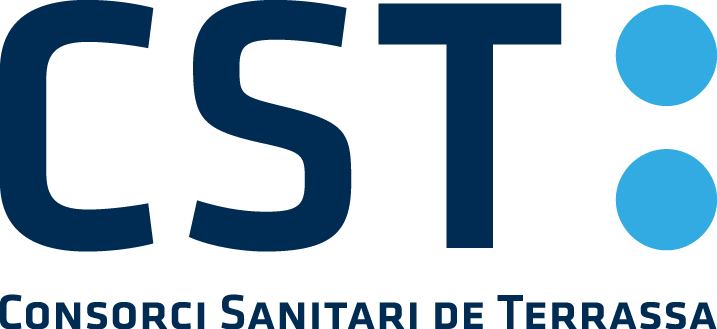
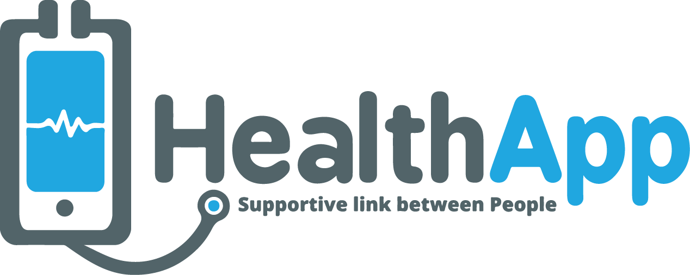

¡Bienvenidos al Hackaton **HACK&HEALTH**!

Aquí encontraréis toda la información necesaria para participar en el evento.

## Los Datos

Los repositorios de datos los encontraréis en la carpeta `data`. Allí encontraréis datos de 3 organizaciones:

| Datos OpenData del Ayuntamiento de Terrassa.  | Datos del Consorci Sanitari de Terrassa (CST)  | Datos de la aplicación HealthApp |
|:------------:|:--------------:|:-----------:|
|  |  |  |

## Cómo participar

Para participar tendréis que:

1. Hacer un `fork` de este repositorio 
2. En la carpeta `teams` tenéis instrucciones de cómo trabajar y una plantilla de cómo tenéis que entregar vuestra solución.
3. Todo lo que programéis, desarrolléis, preparéis, etc. tiene que ir en la carpeta de vuestro equipo que hay dentro de `teams`.
4. Cuando queráis entregar la solución sólo tendréis que hacer un `pull request` a este repo.

